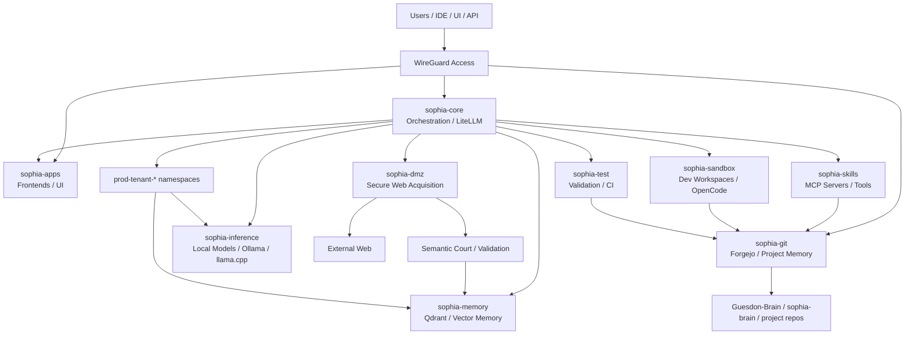

# SOPHIA

**Sovereign Orchestrator Platform for Holistic Intelligence Architecture**

SOPHIA is an open architecture designed to help organizations use artificial intelligence while preserving control over their data, models, and infrastructure.

The project explores how open-source components can be assembled into a coherent and secure platform for deploying, orchestrating, and governing AI systems.

---

## Why SOPHIA

Artificial intelligence adoption is accelerating rapidly, but many organizations face critical challenges:

- Loss of control over data
- Dependence on proprietary platforms
- Security risks when interacting with external models
- Limited governance of AI workflows
- Fragmented tooling around models, agents and knowledge systems

SOPHIA aims to address these challenges by proposing a **sovereign, modular and open architecture**.

---

## Project Goals

SOPHIA focuses on several core principles:

- **Sovereignty**  
  Maintain full control over data, infrastructure and models.

- **Security**  
  Protect systems from data leakage and unsafe model interactions.

- **Orchestration**  
  Provide a structured way to combine models, agents, tools and knowledge systems.

- **Modularity**  
  Assemble existing open-source components into a coherent architecture.

- **Reproducibility**  
  Ensure deployments can be reproduced and audited.

---

## Architecture Overview

SOPHIA integrates several open-source technologies into a unified architecture.

Current experimental stack includes:

- **OKD / Kubernetes** — infrastructure orchestration
- **LiteLLM** — unified model routing layer
- **Ollama** — local model execution
- **Qdrant** — vector database for RAG systems
- **Forgejo** — project memory and documentation versioning

Additional architectural concepts explored:

- secure web acquisition layers
- semantic validation pipelines
- controlled workspace environments for AI agents
- project-centric orchestration

More details are available in the documentation.

---

## Project Status

SOPHIA is currently an **experimental architecture project**.

Current stage:

- initial infrastructure deployed
- architectural documentation in progress
- whitepaper under preparation
- public repository structure being established

The project aims to evolve into a **reference architecture for sovereign AI infrastructures**.

---

## Documentation

Documentation will progressively be published in the `/docs` directory.

Planned topics include:

- architecture overview
- security model
- context management
- workspace management
- orchestration model
- deployment examples

---

## Whitepaper

A technical whitepaper describing the architecture and its motivations is currently in preparation.

---

## Contributing

Contributions, discussions and feedback are welcome.

The project is currently in an early stage and open to ideas from engineers, researchers and infrastructure specialists interested in sovereign AI architectures.

---

## Author

Project initiated by **Damien Guesdon**.

With 20+ years of experience in infrastructure, networking and systems architecture, and ongoing specialization in artificial intelligence engineering.

---

## License

Apache License 2.0
