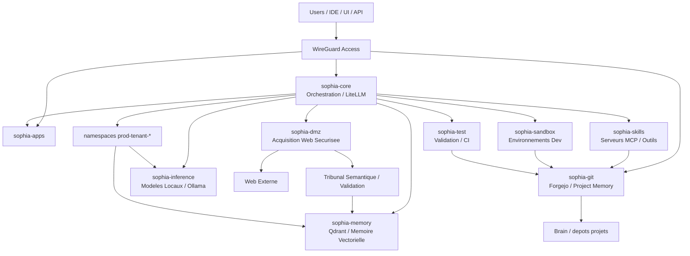

# SOPHIA

**Sovereign Orchestrator Platform for Holistic Intelligence Architecture**

SophIA est une architecture ouverte conque pour aider les organisations a utiliser l'intelligence artificielle tout en preservant le controle de leurs donnees, de leurs modeles et de leur infrastructure.

Le projet explore comment des composants open-source peuvent etre assembles en une plateforme coherente et securisee pour deployer, orchestrer et gouverner des systemes d'IA.

---

## Pourquoi SophIA

L'adoption de l'intelligence artificielle s'accelere rapidement, mais de nombreuses organisations font face a des defis critiques :

- Perte de controle sur les donnees
- Dependance envers des plateformes proprietaires
- Risques de securite lors des interactions avec des modeles externes
- Gouvernance limitee des flux de travail IA
- Outillage fragmente autour des modeles, agents et systemes de connaissance

SophIA vise a repondre a ces defis en proposant une architecture souveraine, modulaire et ouverte.

---

## Objectifs du projet

SophIA se concentre sur plusieurs principes fondamentaux :

- **Souverainete.** Maintenir un controle total sur les donnees, l'infrastructure et les modeles.
- **Securite.** Proteger les systemes contre les fuites de donnees et les interactions non securisees avec les modeles.
- **Orchestration.** Fournir une maniere structuree de combiner modeles, agents, outils et systemes de connaissance.
- **Modularite.** Assembler des composants open-source existants en une architecture coherente.
- **Reproductibilite.** Garantir que les deploiements peuvent etre reproduits et audites.

---

## Vue d'ensemble de l'architecture

SophIA integre plusieurs technologies open-source dans une architecture unifiee.

La stack experimentale actuelle inclut :

- **OKD / Kubernetes** : orchestration infrastructurelle
- **LiteLLM** : couche de routage de modeles unifiee
- **Ollama** : execution locale de modeles
- **Qdrant** : base vectorielle pour les systemes RAG
- **Forgejo** : versionnement de la memoire et de la documentation du projet

Concepts architecturaux complementaires explores :

- couches d'acquisition web securisees
- pipelines de validation semantique
- environnements de travail controles pour les agents IA
- orchestration centree sur le projet

```mermaid
flowchart TB
    U[Users / IDE / UI / API]
    WG[WireGuard Access]
    U --> WG

    WG --> APPS[sophia-apps]
    WG --> CORE[sophia-core\nOrchestration / LiteLLM]
    WG --> GIT[sophia-git\nForgejo / Project Memory]

    CORE --> INFER[sophia-inference\nModeles Locaux / Ollama]
    CORE --> MEM[sophia-memory\nQdrant / Memoire Vectorielle]
    CORE --> SKILLS[sophia-skills\nServeurs MCP / Outils]
    CORE --> DMZ[sophia-dmz\nAcquisition Web Securisee]
    CORE --> SANDBOX[sophia-sandbox\nEnvironnements Dev]
    CORE --> TEST[sophia-test\nValidation / CI]
    CORE --> APPS

    SKILLS --> GIT
    SANDBOX --> GIT
    TEST --> GIT

    DMZ --> WEB[Web Externe]
    DMZ --> COURT[Tribunal Semantique / Validation]
    COURT --> MEM

    GIT --> BRAIN[Brain / depots projets]

    PROD[namespaces prod-tenant-*]
    CORE --> PROD
    PROD --> MEM
    PROD --> INFER
```

Plus de details sont disponibles dans la documentation.

---

## Statut du projet

SophIA est actuellement un projet d'architecture experimentale.

Etape actuelle :

- infrastructure initiale deployee
- documentation architecturale en cours
- livre blanc en preparation
- structure du depot public en cours d'etablissement

Le projet vise a evoluer vers une architecture de reference pour les infrastructures d'IA souveraines.

---

## Documentation

La documentation est progressivement publiee dans le repertoire `docs/`.

Sujets prevus :

- vue d'ensemble de l'architecture
- modele de securite
- gestion de contexte
- gestion des espaces de travail
- modele d'orchestration
- exemples de deploiement

---

## Livre blanc

Un livre blanc technique decrivant l'architecture et ses motivations est actuellement en preparation.

---

## Contribution

Les contributions, discussions et retours sont les bienvenus. Le projet en est a un stade precoce et est ouvert aux idees des ingenieurs, chercheurs et specialistes de l'infrastructure interesses par les architectures d'IA souveraines.

---

## Auteur

Projet initie par **Damien Guesdon**.

Avec plus de 20 ans d'experience en infrastructure, reseaux et architecture systeme, et une specialisation en cours en ingenierie de l'intelligence artificielle.

---

## Licence

Apache License 2.0

---

Site officiel : https://sophia.kisai.fr
